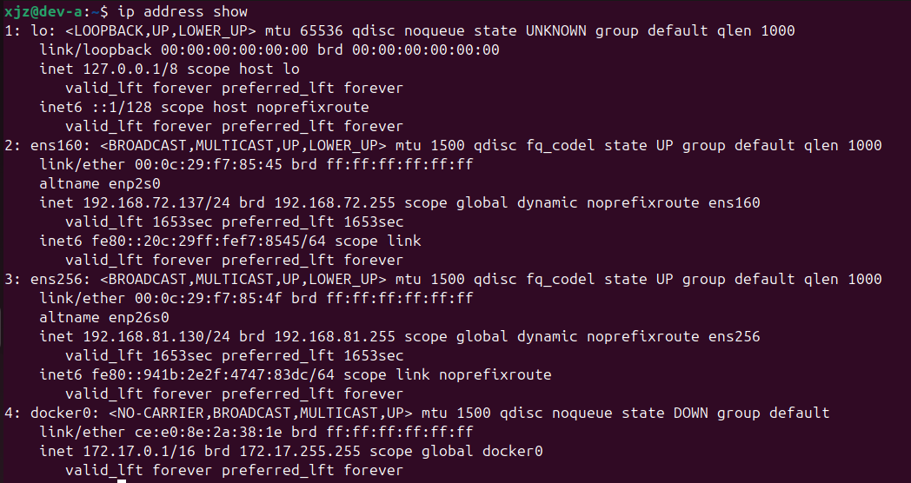
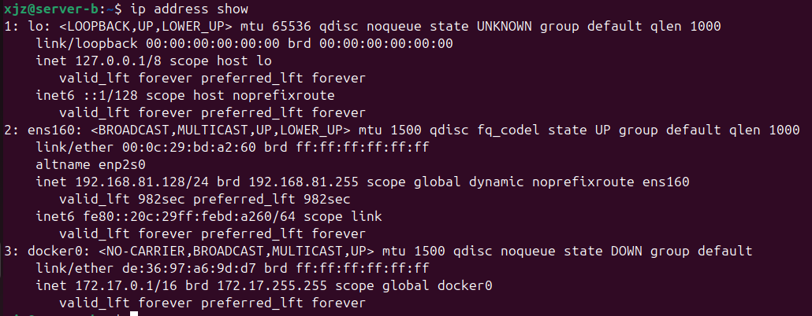
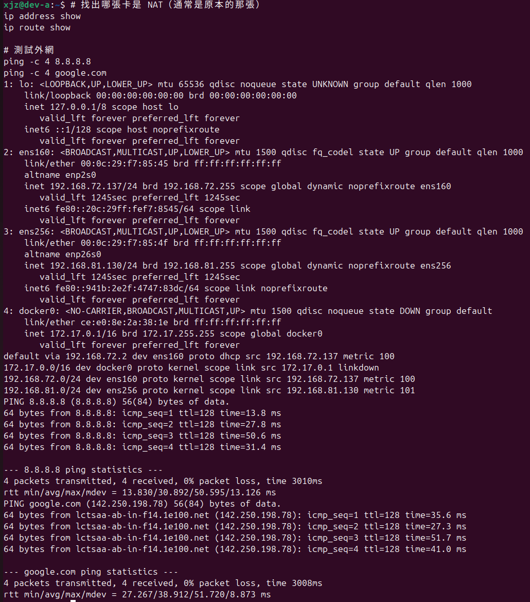
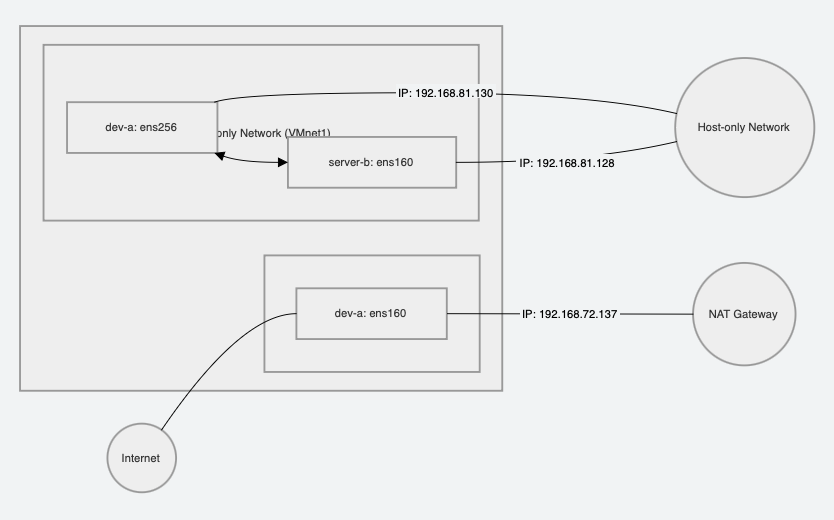

# W02｜VMware 網路模式與雙 VM 排錯

## 網路配置

| VM | 網卡 | 模式 | IP | 用途 |
|---|---|---|---|---|
| dev-a | NIC 1 | NAT | 192.168.72.137 | 上網 |
| dev-a | NIC 2 | Host-only | 192.168.81.130 | 內網互連 |
| server-b | NIC 1 | Host-only | 192.168.81.128 | 內網互連 |

## 連線驗證紀錄

- [x] dev-a NAT 可上網：`ping google.com` 輸出:0% packet loss

- [x] 雙向互 ping 成功：貼上雙方 `ping` 輸出：
  1.dev-a -> server-b (192.168.81.128)：成功，RTT avg 0.6ms
  2.server-b -> dev-a (192.168.81.130)：成功，RTT avg 1.1ms
- [x] SSH 連線成功：`ssh <user>@<ip> "hostname"` 輸出：server-b
- [x] SCP 傳檔成功：`cat /tmp/test-from-dev.txt` 在 server-b 上的輸出：Hello from dev-a
- [x] server-b 不能上網：`ping 8.8.8.8` 失敗輸出：Network is unreachable

## 故障演練一：介面停用

| 項目 | 故障前 | 故障中 | 回復後 |
|---|---|---|---|
| server-b 介面狀態 | UP | DOWN | UP, LOWER_UP |
| dev-a ping server-b | 成功 | 失敗 | 成功 |
| dev-a SSH server-b | 成功 | 失敗 | 成功 |

## 故障演練二：SSH 服務停止

| 項目 | 故障前 | 故障中 | 回復後 |
|---|---|---|---|
| ss -tlnp grep :22 | 有監聽 | 無監聽 | 空值 |
| dev-a ping server-b | 成功 | 成功 | 成功 |
| dev-a SSH server-b | 成功 | Connection refused | 成功 |

## 排錯順序
（寫出你的 L2 → L3 → L4 排錯步驟與每層使用的命令）
1.L2 (介面層)：使用 ip address show 檢查網卡是否為 UP

2.L3 (網路層)：使用 ip route show 檢查路由，並用 ping 測試封包是否能到達目標 IP

3.L4 (服務層)：使用 ss -tlnp 檢查 Port 22 是否監聽，並嘗試 ssh 連線觀察報錯訊息

## 網路拓樸圖
（嵌入或連結 network-diagram.png）

## 排錯紀錄
- 症狀：停止 SSH 服務後，ss -tlnp 仍看到 22 埠，且 dev-a 依然能連入
- 診斷：查 systemctl status ssh 發現有 ssh.socket 正在觸發服務
- 修正：同時下指令 sudo systemctl stop ssh.service ssh.socket
- 驗證：再次連線出現 Connection refused，確認故障注入成功

## 設計決策
1.在實驗過程中，為什麼優先選擇透過 Host-only 網段（192.168.81.x）進行 SSH 連線？
Ans：雖然 NAT 網段通常有現成的 DHCP 比較方便。
但 Host-only 是純虛擬的封閉網段，IP 位址最不容易變動。這確保了我在編寫排錯腳本或紀錄時，不會因為換個 Wi-Fi 環境導致 IP 位址跳掉，讓實驗結果可被穩定地驗證。

2.為什麼採用 NAT + Host-only 雙網卡設計？
Ans：dev-a 作為管理機，需要 NAT 下載套件與更新，並需要 Host-only 進入內部私有網段。
server-b 設定為 純 Host-only，確保該伺服器即便存在漏洞，攻擊者也無法從外網直接滲透，且 server-b 上的資料不會外流至網際網路，模擬真實企業環境中的後端資料庫或內部 API Server。
