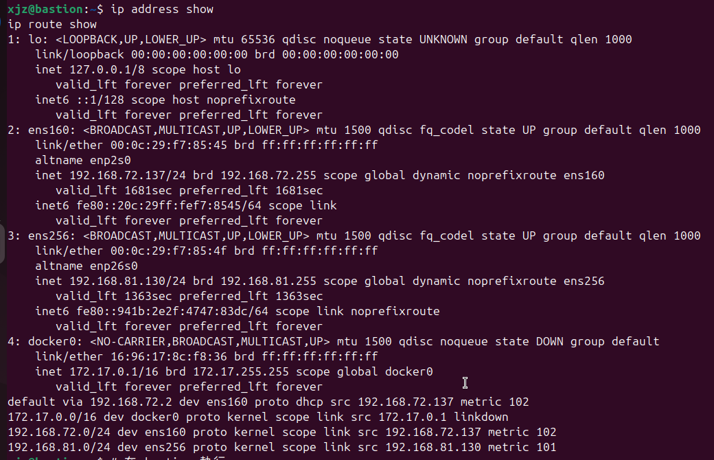
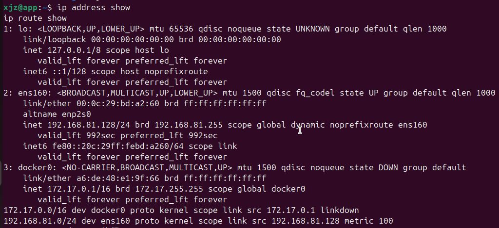
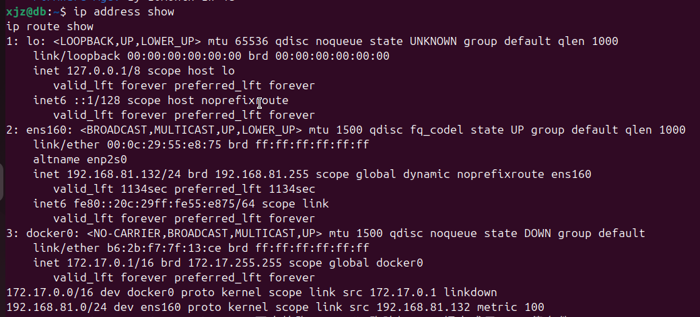
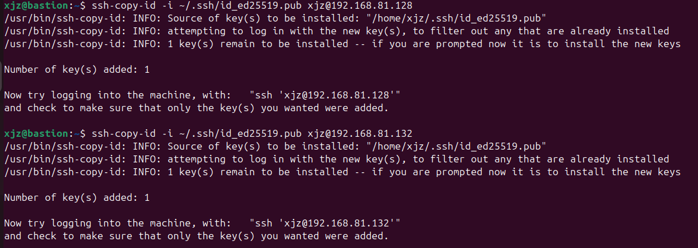
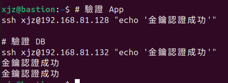
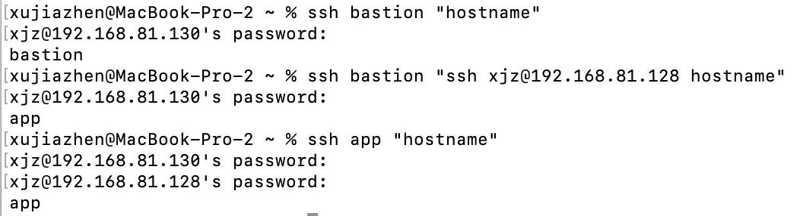
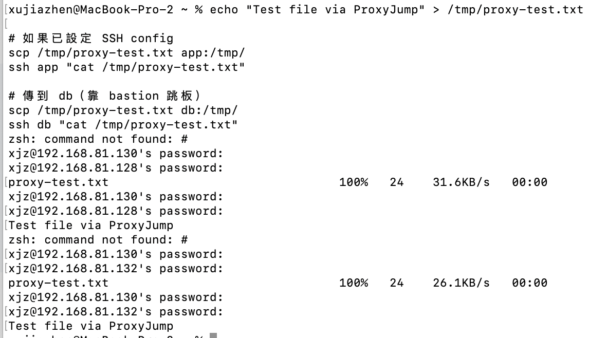

# W03｜多 VM 架構：分層管理與最小暴露設計

## 網路配置

| VM | 角色 | 網卡 | 模式 | IP | 開放埠與來源 |
|---|---|---|---|---|---|
| bastion | 跳板機 | NIC 1 | NAT | 192.168.72.137 | SSH from any |
| bastion | 跳板機 | NIC 2 | Host-only | 192.168.81.130 | — |
| app | 應用層 | NIC 1 | Host-only | 192.168.81.128 | SSH from 192.168.56.0/24 |
| db | 資料層 | NIC 1 | Host-only | 192.168.81.132 | SSH from app + bastion |

分層架構與最小暴露原則：
- 這週的實驗讓我體會到，不應該讓所有的伺服器都直接暴露在網際網路上。透過跳板機作為唯一入口，可以將重要的App和DB放在沒有外網IP的內網區域。
- 最小暴露原則：就是只給予必要的存取權限。例如DB就不需要對全世界開放SSH，只需要對內網的跳板機或應用程式開放，這樣即使外網有人攻擊，也摸不到最核心的資料庫

## SSH 金鑰認證

- 金鑰類型：ed25519
- 公鑰部署到：xjz@app 和 xjz@db 的 ~/.ssh/authorized_keys
- 免密碼登入驗證：
  - bastion → app：金鑰認證成功
  - bastion → db：金鑰認證成功

## 防火牆規則

### app 的 ufw status

Status: active
Logging: on (low)
Default: deny (incoming), allow (outgoing), deny (routed)
To                         Action      From
--                         ------      ----
22/tcp                     ALLOW IN    192.168.81.0/24

### db 的 ufw status
Status: active
To                         Action      From
--                         ------      ----
22/tcp                     ALLOW IN    192.168.81.128
22/tcp                     ALLOW IN    192.168.81.130
### 防火牆確實在擋的證據
xjz@bastion:~$ curl 192.168.81.128:8080
curl: (7) Failed to connect to 192.168.81.128 port 8080: Connection refused

## ProxyJump 跳板連線
- 指令：Host app
    HostName 192.168.81.128
    User xjz
    ProxyJump bastion
- 驗證輸出：xujiazhen@MacBook-Pro-2 ~ % ssh app "hostname" 輸出 app
- SCP 傳檔驗證：scp /tmp/proxy-test.txt db:/tmp/ 傳輸成功，且 cat 驗證內容一致

## 故障場景一：防火牆全封鎖

| 項目 | 故障前 | 故障中 | 回復後 |
|---|---|---|---|
| app ufw status | active + rules | deny all | active (allow 22) |
| bastion ping app | 成功 | Request timeout | 成功 |
| bastion SSH app | 成功 | **timed out** | 成功 |

## 故障場景二：SSH 服務停止

| 項目 | 故障前 | 故障中 | 回復後 |
|---|---|---|---|
| ss -tlnp grep :22 | 有監聽 | 無監聽 | 有監聽 |
| bastion ping app | 成功 | 成功 | 成功 |
| bastion SSH app | 成功 | **refused** | 成功 |

## timeout vs refused 差異
- Connection timed out：通常是網路層 (L3/L4 防火牆) 的問題。封包被直接丟棄（Drop），主機裝死不回應，導致發送端等太久而逾時

- Connection refused：通常是應用層 (L4 服務) 的問題。網路是通的，但目標主機的該埠口沒有程式在監聽（例如 SSH 沒開），主機主動回傳拒絕連線的封包
## 網路拓樸圖
（嵌入或連結 network-diagram）

## 排錯紀錄
- 症狀：
- 診斷：（你首先查了什麼？）
- 修正：（做了什麼改動？）
- 驗證：（如何確認修正有效？）

## 設計決策
（說明本週至少 1 個技術選擇與取捨，例如：為什麼 db 允許 bastion 直連而不是只允許從 app 跳？）
