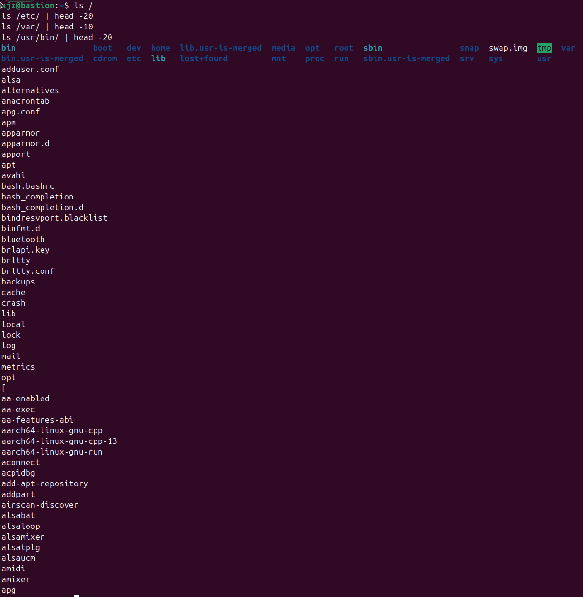
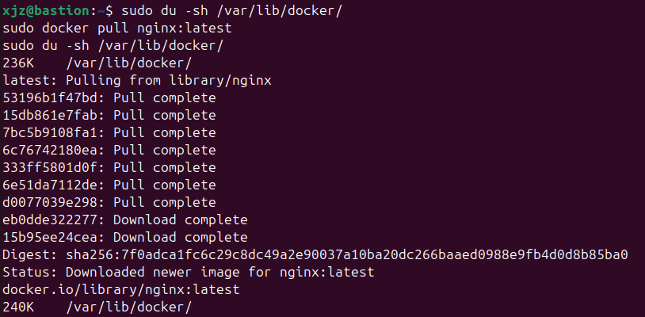
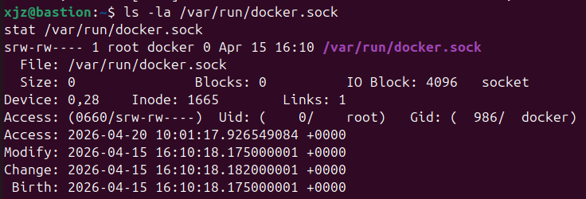

# W04｜Linux 系統基礎：檔案系統、權限、程序與服務管理

## FHS 路徑表

| FHS 路徑 | FHS 定義 | Docker 用途 |
|---|---|---|
| /etc/docker/ | 系統級設定檔目錄 | 存放 daemon.json（自訂引擎設定） |
| /var/lib/docker/ | 程式的持久性狀態資料 | 存放 Images、Containers、Volumes 資料 |
| /usr/bin/docker | 使用者可執行檔 | Docker CLI 客戶端程式 |
| /run/docker.sock | 執行期暫存（Unix Socket） | CLI 與 Daemon 通訊的管道（門戶） |

## Docker 系統資訊

- Storage Driver：overlayfs (driver-type: io.containerd.snapshotter.v1)
- Docker Root Dir：/var/lib/docker
- 拉取映像前 /var/lib/docker/ 大小：234K
- 拉取映像後 /var/lib/docker/ 大小：240K

## 權限結構

### Docker Socket 權限解讀
輸出：srw-rw---- 1 root docker 0 Apr 20 10:37 /var/run/docker.sock
- s: 檔案類型為 Socket。
- rw- (owner: root): root 使用者有完整讀寫權限。
- rw- (group: docker): docker 群組成員可讀寫，藉此控制 Docker。
- --- (others): 其他使用者完全無法存取，確保安全性

### 使用者群組
輸出：uid=1000(xjz) gid=1000(xjz) groups=1000(xjz),27(sudo),986(docker)...
- 說明: 目前 xjz 已成功加入 docker 群組，具備免 sudo 操作 Docker 的權限

### 安全意涵
為什麼 docker group ≈ root？
因為 Docker Daemon 是以 root 權限運行的。當我們加入 docker 群組，就獲得了對Daemon下令的權力。
安全示範觀察：我執行了 docker run -v /etc/shadow:/host-shadow alpine cat /host-shadow，發現在主機上身為普通使用者的我，竟然能透過容器讀取到主機最敏感的密碼雜湊檔。這證明了只要能控 Docker，就能繞過主機權限限制存取任何檔案。

## 程序與服務管理

### systemctl status docker
Active: active (running) since Mon 2026-04-20 10:37:08 UTC;
Main PID: 1456 (dockerd)

### journalctl 日誌分析
（貼上 `journalctl -u docker --since "1 hour ago"` 的重點摘錄，說明看到什麼事件）
重點摘錄：
- level=info msg="image pulled": 紀錄了 Nginx 映像檔下載完成
- level=info msg="API listen on /run/docker.sock": 證實Daemon啟動時建立了通訊點
- received task-delete event: 紀錄了容器停止並刪除的歷程

### CLI vs Daemon 差異
- CLI (/usr/bin/docker): 只是個翻譯官，負責把指令轉成 API 傳出去
- Daemon (dockerd): 真正的工廠老闆，負責管理容器運作
- 為什麼 docker --version 正常不代表可用？ 因為版本查詢只需 CLI 檔案存在即可，不需連接到後台 Daemon。要確認可用必須執行 docker ps 等涉及通訊的指令
## 環境變數

- $PATH：/usr/local/sbin:/usr/local/bin:/usr/sbin:/usr/bin:/sbin:/bin
- which docker：/usr/bin/docker
- 容器內外環境變數差異觀察：主機的 $HOME 為 /home/xjz，容器內則為 /root；主機環境包含許多自訂路徑，容器內則是被精簡過的標準路徑，實現環境隔離

## 故障場景一：停止 Docker Daemon

| 項目 | 故障前 | 故障中 | 回復後 |
|---|---|---|---|
| systemctl status docker | active | inactive (dead) | active (running) |
| docker --version | 正常 | 正常 | 正常 |
| docker ps | 正常 | Cannot connect | 正常  |
| ps aux grep dockerd | 有 process | 無 process | 有新 PID process |

## 故障場景二：破壞 Socket 權限

| 項目 | 故障前 | 故障中 | 回復後 |
|---|---|---|---|
| ls -la docker.sock 權限 | srw-rw---- | srw------- | srw-rw---- |
| docker ps（不加 sudo） | 正常 | permission denied | 正常 |
| sudo docker ps | 正常 | （填入） | 正常 |
| systemctl status docker | active | active (running) | active (running) |

## 錯誤訊息比較

| 錯誤訊息 | 根因 | 診斷方向 |
|---|---|---|
| Cannot connect to the Docker daemon | Daemon 服務沒開或 Socket 檔不存在 | 用 systemctl 檢查服務與 ps 檢查進程 |
| permission denied…docker.sock | 使用者不屬 docker 群組或 Socket 權限被改 | 用 id 檢查群組與 ls -la 檢查 Socket 權限 |

- 差異說明：Cannot connect 是連門都找不到；permission denied 是看到門了但你沒鑰匙或門鎖換了

## 排錯紀錄
- 症狀：執行 docker ps 出現 permission denied
- 診斷：輸入 id 發現自己不在 docker 群組，且 ls -la /run/docker.sock 顯示需要 docker 群組權限
- 修正：執行 sudo usermod -aG docker $USER 並以 newgrp docker 刷新身份
- 驗證：不加 sudo 執行 docker ps 成功回傳空的容器清單

## 設計決策
在教學環境中，我們選擇將使用者加入 docker 群組而非每次使用 sudo。
取捨理由：
- 方便性：避免頻繁輸入密碼，且利於腳本自動化
- 風險：這會導致帳號安全性下降，因為任何能存取該帳號的人都能透過 Docker 取得主機 root 權限（如 Shadow 實驗所示）。在生產環境中，應考慮使用 sudo 或 Rootless Docker 來降低此風險
