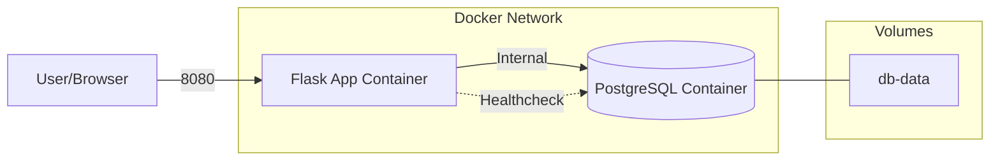
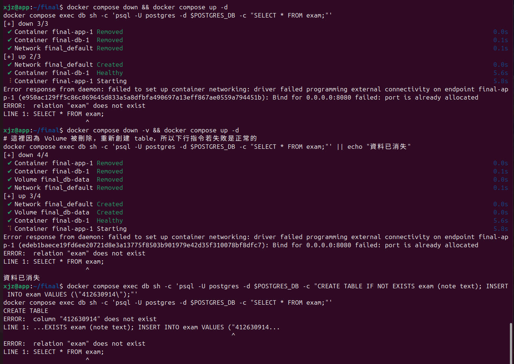
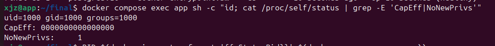
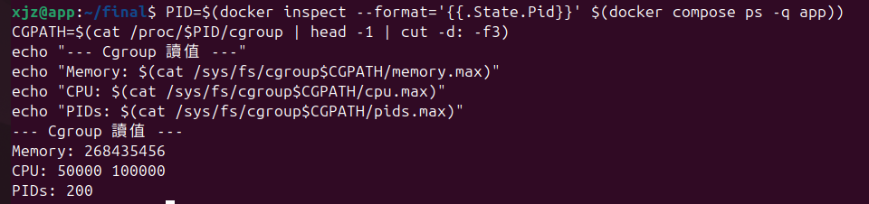
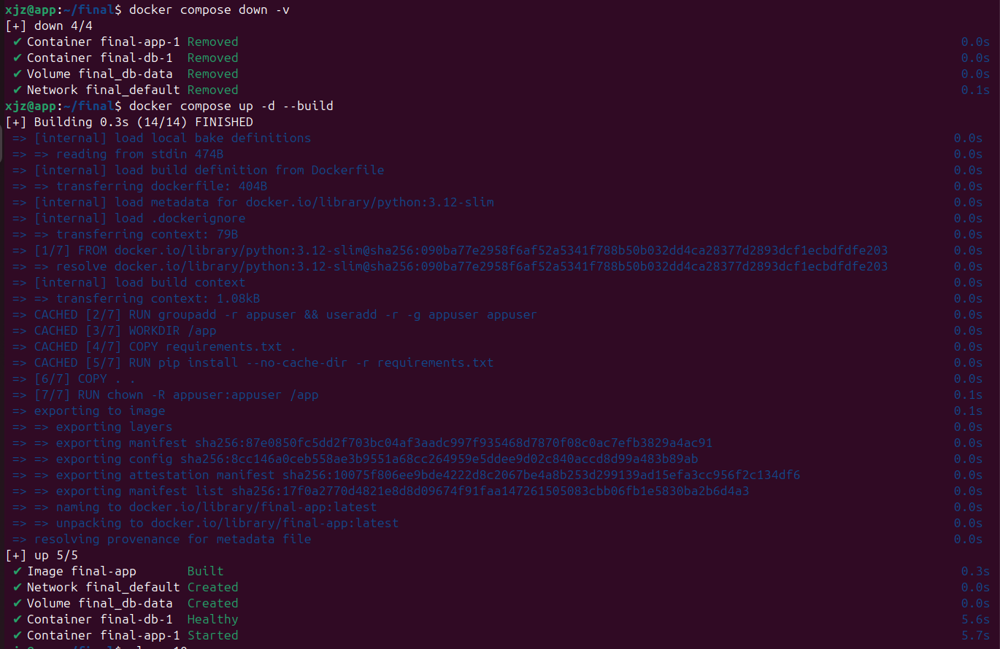
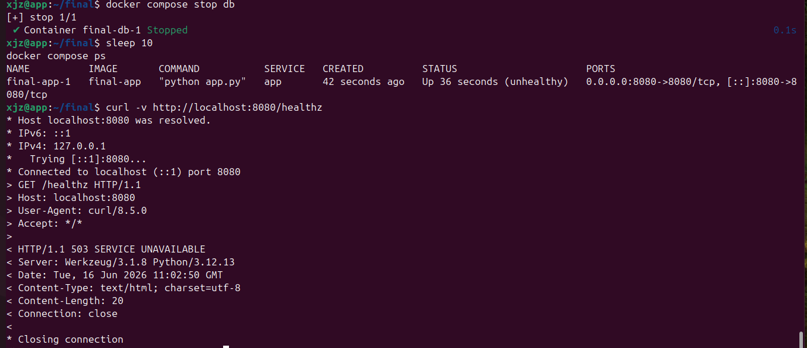
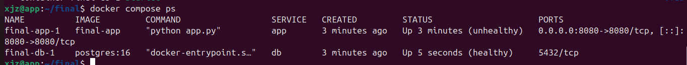
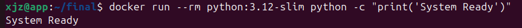
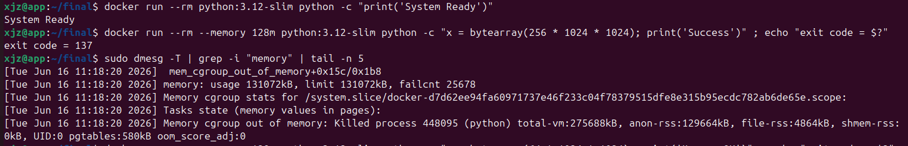
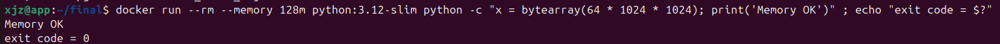

# 期末實作 — <412630914> <許家禎>

## 1. 架構總覽
<Mermaid 圖 + 一段話說明>

採用 Flask 應用程式作為前端，PostgreSQL 作為資料存儲，透過 Docker Compose 定義容器間橋接網路 (bridge network) 與深度健康檢查 (deep healthcheck) 機制，實現服務相依性的邏輯隔離與自動化自癒能力。

## 2. Part A：底座與基準點
<ssh 證據 + 版本 + snapshot>


## 3. Part B：Dockerfile 與快取
<Dockerfile + 兩次 build 對照>

 **Dockerfile**
```
FROM python:3.12-slim

RUN groupadd -r appuser && useradd -r -g appuser appuser

WORKDIR /app

COPY requirements.txt .
RUN pip install --no-cache-dir -r requirements.txt

COPY . .
RUN chown -R appuser:appuser /app

USER appuser
EXPOSE 8080
CMD ["python", "app.py"]
```


 **.dockerignore**
```
.env
__pycache__
*.pyc
.git
.gitignore
```


### 為什麼聽 8080 不聽 80？
符合 Linux 安全規範，1024 以下為特權埠 (Privileged Ports)，綁定需 root 權限。為落實最小權限原則 (Least Privilege)，容器以 appuser (UID 1000) 執行，故選用 8080 埠以避免提權攻擊。

## 4. Part C：Compose 與資料持久化
<compose.yaml 重點 + 三段對照>

 **compose.yaml重點**
```
services:
  db:
    image: postgres:16
    volumes:
      - db-data:/var/lib/postgresql/data  # 定義持久化卷
    healthcheck:
      test: ["CMD-SHELL", "pg_isready -U postgres"]
      interval: 5s
      timeout: 3s
      retries: 5

volumes:
  db-data:  # 宣告 Named Volume
```

 **.env.example**
```
POSTGRES_DB=examdb
POSTGRES_USER=postgres
POSTGRES_PASSWORD=mysecretpassword
```
   三段對照：

   | 階段 | 命令 | `SELECT * FROM exam` 結果 |
   | ---- | ---- | ------------------------- |
   | 砍容器重建 | `docker compose down && docker compose up -d` | **還在** |
   | 連 volume 一起砍 | `docker compose down -v && docker compose up -d` | **消失** |
   | 重寫 | 再 INSERT 一次 | 重新出現 |
   


### down vs down -v
- docker compose down：僅停止並刪除容器與網路，但 Named Volume 會保留，資料持久化。
  
- docker compose down -v：除了停止容器外，會連同 volumes 區塊定義的 Named Volume 一併抹除。這是一個破壞性的刪除動作。

**Named Volume 的生命週期：**
其生命週期獨立於容器。它不會因為容器被停止或移除而消失，只有在被顯式刪除 (docker volume rm) 或使用 down -v 時才會被回收。這保證了資料庫在容器重啟時不會丟失資料。


## 5. Part D：生產化加固
<權限驗證輸出 + cgroup 讀值對照表>
### yaml 的值怎麼對回 cgroup 檔案？

**1. 記憶體配額**：268435456 (對應 `memory: 256m`)
記憶體限制在 `memory.max` 檔案中以 Byte 為單位記錄。
* 計算公式：$Value (Bytes) = 256 \times 1024 \times 1024$
* 數值意義：$256 \times 1024^2 = 268,435,456$ Bytes。這就是 Kernel 執行記憶體硬上限的絕對數值。
**2. CPU 配額**：50000 100000 (對應 `cpus: "0.5"`)
CPU 限制是透過 CFS (Completely Fair Scheduler) 的 **配額 (Quota)** 與 **週期 (Period)** 機制來執行的。`cpu.max` 檔案的格式為 `quota period`。
* 預設週期 (Period)：Linux 預設排程週期為 $100,000$ 微秒 (即 $0.1$ 秒)。
* 配額 (Quota)：容器在一個週期內允許使用的總運算時間（單位為微秒）。
* 數值意義：
* Quota (50,000)：代表容器在 $0.1$ 秒的週期內，最多只能使用 $0.05$ 秒的 CPU 時間。
* 運算比率：$\frac{50,000}{100,000} = 0.5$。





**最終版 compose.yaml**
```
services:
  app:
    build: .
    restart: always
    environment:
      DB_HOST: db
    # 資源上限
    deploy:
      resources:
        limits:
          memory: 256m
          cpus: "0.5"
        pids: 200
    # 權限加固
    user: "1000:1000"
    read_only: true
    tmpfs:
      - /tmp
    cap_drop:
      - ALL
    security_opt:
      - no-new-privileges:true
    # 健康檢查
    healthcheck:
      test: ["CMD", "curl", "-f", "http://localhost:8080/healthz"]
      interval: 10s
      timeout: 3s
      retries: 3
    logging:
      driver: "json-file"
      options:
        max-size: "10m"
        max-file: "3"

  db:
    image: postgres:16
    volumes:
      - db-data:/var/lib/postgresql/data
    environment:
      POSTGRES_DB: ${POSTGRES_DB}
      POSTGRES_USER: ${POSTGRES_USER}
      POSTGRES_PASSWORD: ${POSTGRES_PASSWORD}
    deploy:
      resources:
        limits:
          memory: 512m
          cpus: "0.5"
    logging:
      driver: "json-file"
      options:
        max-size: "10m"
        max-file: "3"
    healthcheck:
      test: ["CMD-SHELL", "pg_isready -U postgres"]
      interval: 5s
      timeout: 5s
      retries: 5

volumes:
  db-data:
```

## 6. Part E：故障演練
### 故障 1：<F1>
- 注入方式：docker compose stop db
- 故障前：
  
  1.指令：docker compose ps
  
  2.輸出：app Up (healthy), db Up (healthy)
  
- 故障中：
  
  1.指令：curl -v http://localhost:8080/healthz
  
  2.輸出：< HTTP/1.1 503 SERVICE UNAVAILABLE
  
  3.容器狀態：app Up (unhealthy)
  
- 回復後：
  
  1.指令：docker compose start db 後等待 healthcheck 週期完成
  
  2.輸出：app Up (healthy)
  
- 診斷推論：本演練證明了 unhealthy ≠ dead。當資料庫層 (DB) 斷線，應用程式雖仍在執行，但透過 healthcheck 機制主動感知依賴異常，回傳 503 錯誤。這保護了前端監控層，防止無效請求繼續湧入。




### 故障 2：<F3>
- 注入方式：docker run --rm --memory 128m python:3.12-slim python -c "x = bytearray(256 * 1024 * 1024)"; echo "exit code = $?"
- 故障前：環境資源正常，系統穩態。
- 故障中：
  
  1.輸出：exit code = 137 (即 128 + SIGKILL 9)
  
  2.Kernel 鑑定：sudo dmesg -T | grep -i "memory" 顯示 Memory cgroup out of memory:     Killed process。
- 回復後：降額配置請求 (64MB) 執行成功 (exit code = 0)。
- 診斷推論：驗證了 Linux Kernel 的 OOM Killer 機制。當容器資源配置 (Cgroup) 被強制限制時，Kernel 為保護主機記憶體不被單一進程耗盡，會採取強制 SIGKILL 終止該進程。





### 三症狀分層表（必答）
| 症狀 | 最可能的層 | 第一條驗證命令 |
| ---- | ---------- | -------------- |
| timeout |網路層 (L3)| traceroute |
| connection refused |傳輸層 (L4)|ss -tlnp|
| HTTP 503 |應用層 (L7)|docker compose logs|

## 7. 反思（200 字）
這學期從 VM 做到 production-ready 容器，「隔離」這個概念在 VM、namespace、
cgroup、權限階梯四個地方各出現一次——它們在防的東西一樣嗎？

這學期從 VM 到容器化的演練，讓我深刻體會到「隔離」並非單一技術，而是層層防禦的縱深結構：
VM (硬體隔離)：防範底層核心受損，確保宿主機與應用程式的物理邊界。
Namespace (視野隔離)：解決邏輯上的資源衝突，讓容器認為自己獨佔 OS，達成程序視角的獨立。
Cgroup (資源隔離)：防禦資源耗竭攻击 (DoS)，嚴格限制 CPU 與記憶體配額，確保多容器共存時的穩定性。
權限階梯 (身份隔離)：則是防禦權限提升 (Privilege Escalation)，透過強制非 root 執行與禁止提權，限制駭客在容器內的破壞力。
這些機制防禦的對象完全不同：VM 防崩潰、Namespace 防干擾、Cgroup 防壟斷、權限階梯防惡意控制。它們並非重複勞動，而是共同構築了一個高韌性的系統。當我們將這些技術從理論應用到 Production-ready 環境時，不僅是為了部署服務，更是為了確保即使某個組件發生故障，威脅也能被侷限在最小範圍內
## 8. Bonus（選做）
