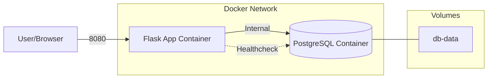
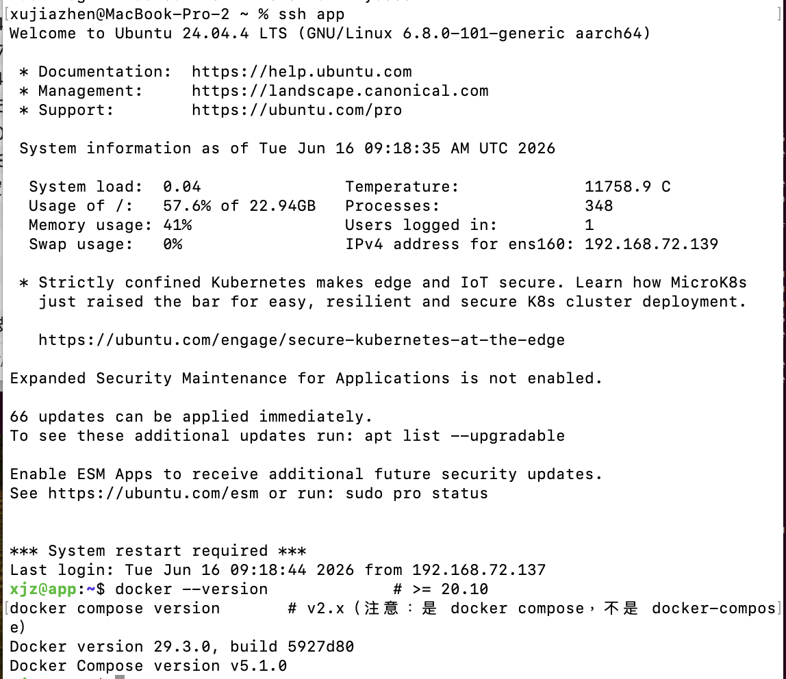
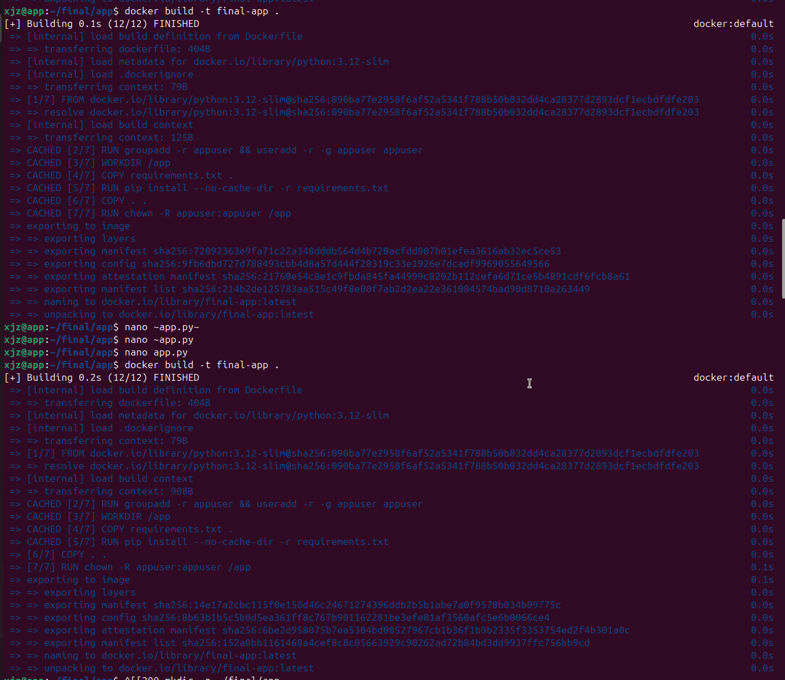

# 期末實作 — <學號> <姓名>

## 1. 架構總覽
<Mermaid 圖 + 一段話說明>

採用 Flask 應用程式作為前端，PostgreSQL 作為資料存儲，透過 Docker Compose 定義容器間橋接網路 (bridge network) 與深度健康檢查 (deep healthcheck) 機制，實現服務相依性的邏輯隔離與自動化自癒能力。

## 2. Part A：底座與基準點
<ssh 證據 + 版本 + snapshot>

## 3. Part B：Dockerfile 與快取
<Dockerfile + 兩次 build 對照>

### 為什麼聽 8080 不聽 80？
符合 Linux 安全規範，1024 以下為特權埠 (Privileged Ports)，綁定需 root 權限。為落實最小權限原則 (Least Privilege)，容器以 appuser (UID 1000) 執行，故選用 8080 埠以避免提權攻擊。

## 4. Part C：Compose 與資料持久化
<compose.yaml 重點 + 三段對照>
### down vs down -v
- docker compose down：僅停止並刪除容器與網路，但 Named Volume 會保留，資料持久化。
  
- docker compose down -v：除了停止容器外，會連同 volumes 區塊定義的 Named Volume 一併抹除。這是一個破壞性的刪除動作。

**Named Volume 的生命週期：**
其生命週期獨立於容器。它不會因為容器被停止或移除而消失，只有在被顯式刪除 (docker volume rm) 或使用 down -v 時才會被回收。這保證了資料庫在容器重啟時不會丟失資料。

## 5. Part D：生產化加固
<權限驗證輸出 + cgroup 讀值對照表>
### yaml 的值怎麼對回 cgroup 檔案？

## 6. Part E：故障演練
### 故障 1：<F1–F4 擇一>
- 注入方式：
- 故障前：
- 故障中：
- 回復後：
- 診斷推論：

### 故障 2：<另一個>
（同上）

### 三症狀分層表（必答）
| 症狀 | 最可能的層 | 第一條驗證命令 |
| ---- | ---------- | -------------- |
| timeout |  |  |
| connection refused |  |  |
| HTTP 503 |  |  |

## 7. 反思（200 字）
這學期從 VM 做到 production-ready 容器，「隔離」這個概念在 VM、namespace、
cgroup、權限階梯四個地方各出現一次——它們在防的東西一樣嗎？

## 8. Bonus（選做）
