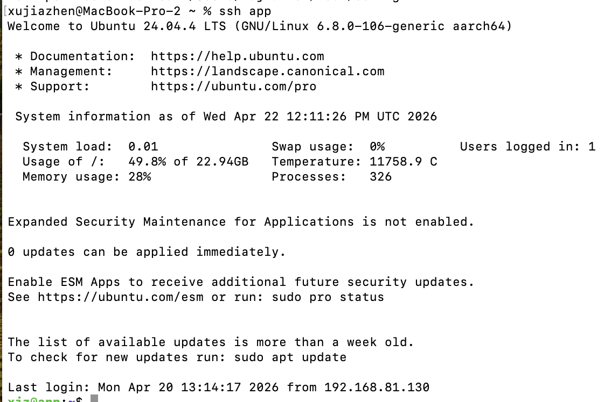
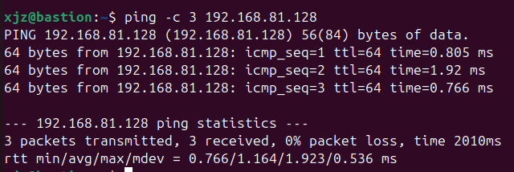
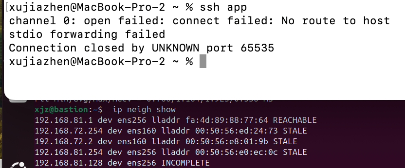
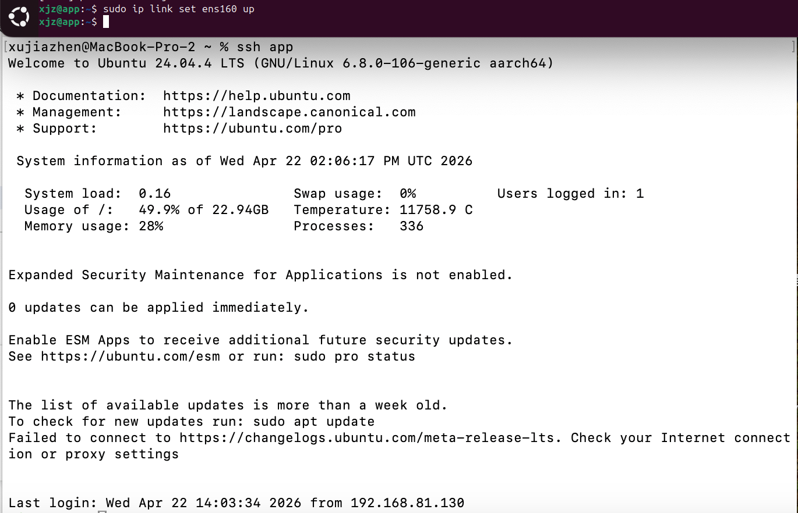
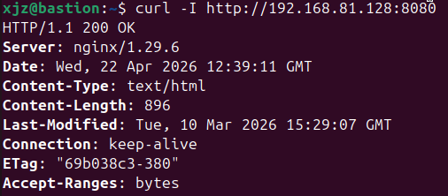
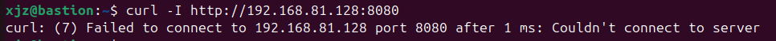
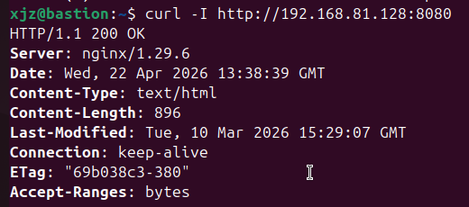

# 期中實作 — <412630914> <許家禎>

## 1. 架構與 IP 表
### IP 配置表
| VM | 角色 | NAT | Host-only | 備註
|---|---|---|---|---|
| bastion | 跳板機 | 192.168.72.137| 192.168.81.130 | 唯一對外入口 
| app | 應用層 | N/A | 192.168.81.128 | 無外網，僅限內網訪問 

### Mermaid 圖

## 2. Part A：VM 與網路
- 在bastion執行 ping -c 3 192.168.81.128 (App) 成功
- 在app執行 ping -c 3 192.168.81.130 (Bastion) 成功

## 3. Part B：金鑰、ufw、ProxyJump
<防火牆規則表 + ssh app 成功證據>
### Bastion
|項目| 動作 | 來源 IP | 目的 Port
|---|---|---|---|
| Default | DENY | Anywhere| Anywhere  
| SSH | ALLOW | Anywhere | Port 22/tcp
### app
|項目| 動作 | 來源 IP | 目的 Port
|---|---|---|---|
| Default | DENY | Anywhere| Anywhere  
| SSH | ALLOW | 192.168.81.130 | 22/tcp
| Web API | ALLOW | 192.168.81.130 | 8080/tcp

## 4. Part C：Docker 服務
<systemctl status docker + curl 輸出>

## 5. Part D：故障演練
### 故障 1：<F1>
- 注入方式：在 app 執行 sudo ip link set ens160 down。
- 故障前：Host 執行 ssh app 成功登入；Bastion 執行 ping 192.168.81.128 正常。
- 故障中：
  1.host 執行 ssh app 出現 Connection timed out。
  2.bastion 執行 ip neigh show 顯示 192.168.81.128 dev ens256 FAILED。
- 回復後：在 app 執行 sudo ip link set ens160 up，連線恢復。
- 診斷推論：由於 ip neigh顯示為 FAILED，代表封包在 L2 (數據鏈路層) 階段就因為找不到 MAC 地址而無法封裝。這證明了實體路徑已斷開，而非上層防火牆的攔截。

**故障前**

**故障中**

**回復後**

### 故障 2：<F3>
- 注入方式：於 app 執行 sudo systemctl stop docker。
- 故障前：bastion 執行 curl -I http://192.168.81.128:8080 回傳 200 OK。
- 故障中：
  1.host 執行 ssh app 依然可以連線
  2.bastion 執行 curl 出現 curl: (7) Failed to connect... Connection refused
- 回復後：
- 
  1.於 app 執行 sudo systemctl start docker。
  
  2.檢查容器狀態:sudo docker ps -a ->手動喚醒容器:sudo docker start web ->驗證監聽:ss -tlnp | grep :8080

  3.驗證程序：於 bastion 重新執行 curl -I http://192.168.81.128:8080。

  4.結果：錯誤訊息從原本的 Connection refused 變回 HTTP/1.1 200 OK，證實 Docker Daemon 重啟後，容器已恢復運作，且端到端通路恢復。
- 診斷推論：與 F1 不同，F3 的 SSH 仍然通暢，且 curl 拿到的是 Connection refused。這代表網路層與防火牆規則。（L3/L4）均正常，封包成功抵達目標但因 port 8080 沒有Docker監聽而被拒絕，判定為服務層級故障。

**故障前**

**故障中**

**回復後**

### 症狀辨識（若選 F1+F2 必答）
兩個都 timeout，我怎麼分？
判斷推理鏈：
- 檢查 ARP 表 (ip neigh)：
 1.如果是 F1：狀態會是 FAILED 或 INCOMPLETE。代表連「門牌（MAC）」都找不到，封包根本發不出去。
 2.如果是 F2：狀態會是 REACHABLE。代表「門牌」是對的，封包已經送到門口，只是被防火牆偷偷丟掉了。
- 檢查 Ping 的錯誤訊息：
 1.F1 通常回報 Destination Host Unreachable
 2.F2 通常回報 Request Timeout
## 6. 反思（200 字）
這次做完，對「分層隔離」或「timeout 不等於壞了」的理解有什麼改變？
在本次實作中，我體會到網路排錯必須遵循 L2→L3→L4→L7 的分層邏輯。原本以為只要 ssh 出現 timeout 就是防火牆問題，但透過實作 F1 故障，在 ip neigh 中觀察到 FAILED 狀態，這才意識到當 L2 的 ARP 無法解析時，上層所有服務都會失效。
在處理 F3 故障恢復時，我也觀察到 Connection refused 與 Timeout 的本質差異：前者代表目標機器在線但拒絕服務，後者則是封包完全沒抵達或被丟棄。透過 ProxyJump 與 UFW 的結合，我成功建立了一個符合「最小暴露原則」的實驗環境。這不僅提升了安全性，更讓我在未來面對複雜故障時，能更有系統地進行定位與排除。
## 7. Bonus（選做）
