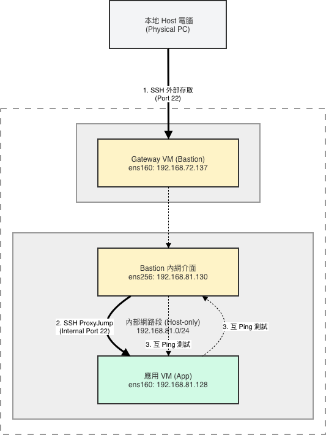

# 期中實作 — <412630914> <許家禎>

## 1. 架構與 IP 表
### IP 配置表
| VM | 角色 | NAT | Host-only | 備註
|---|---|---|---|---|
| bastion | 跳板機 | 192.168.72.137| 192.168.81.130 | 唯一對外入口 
| app | 應用層 | N/A | 192.168.81.128 | 無外網，僅限內網訪問 

### Mermaid 圖

## 2. Part A：VM 與網路
- 在bastion執行 ping -c 3 192.168.81.128 (App) 成功
- 在app執行 ping -c 3 192.168.81.130 (Bastion) 成功

## 3. Part B：金鑰、ufw、ProxyJump
<防火牆規則表 + ssh app 成功證據>
### Bastion
|規則項目| Action | From | To
|---|---|---|---|
| Default | DENY | Anywhere| Anywhere  
| SSH | ALLOW | Anywhere | Port 22/tcp
### app
|規則項目| Action | From | To
|---|---|---|---|
| Default | DENY | Anywhere| Anywhere  
| SSH | ALLOW | 192.168.81.130 | Port 22/tcp
| Web API | ALLOW | 192.168.81.130 | Port 8080/tcp

## 4. Part C：Docker 服務
<systemctl status docker + curl 輸出>

## 5. Part D：故障演練
### 故障 1：<F1/F2/F3 擇一>
- 注入方式：
- 故障前：
- 故障中：
- 回復後：
- 診斷推論：

### 故障 2：<另一個>
（同上）

### 症狀辨識（若選 F1+F2 必答）
兩個都 timeout，我怎麼分？

## 6. 反思（200 字）
這次做完，對「分層隔離」或「timeout 不等於壞了」的理解有什麼改變？

## 7. Bonus（選做）
